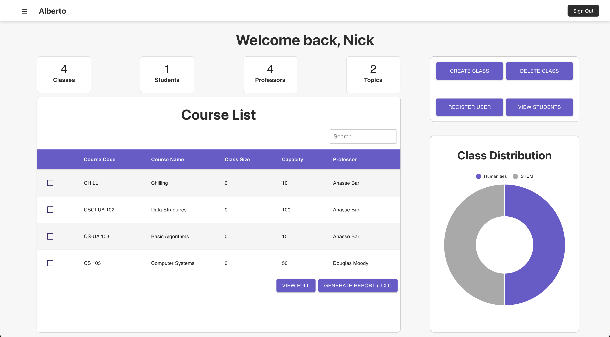
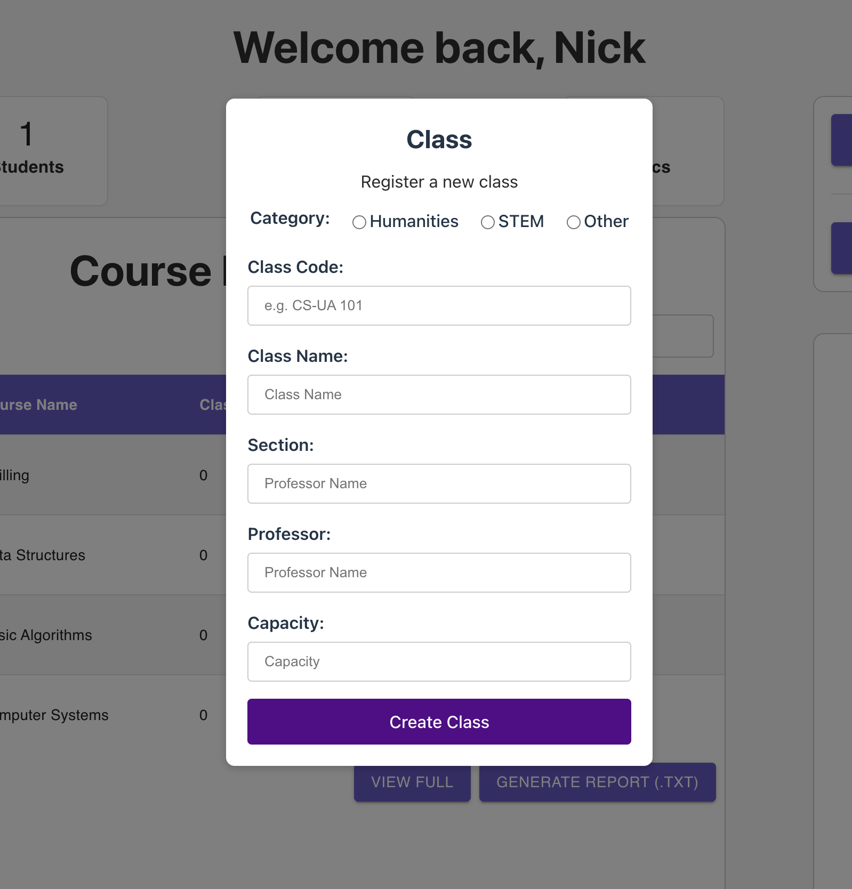
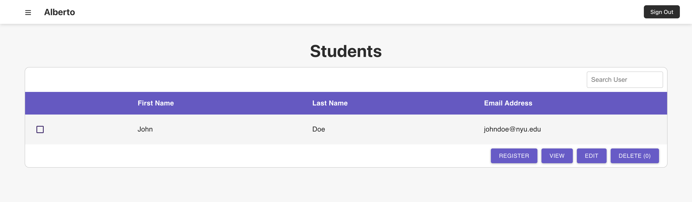
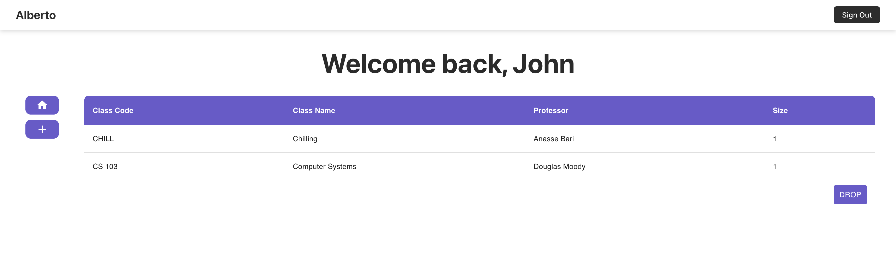
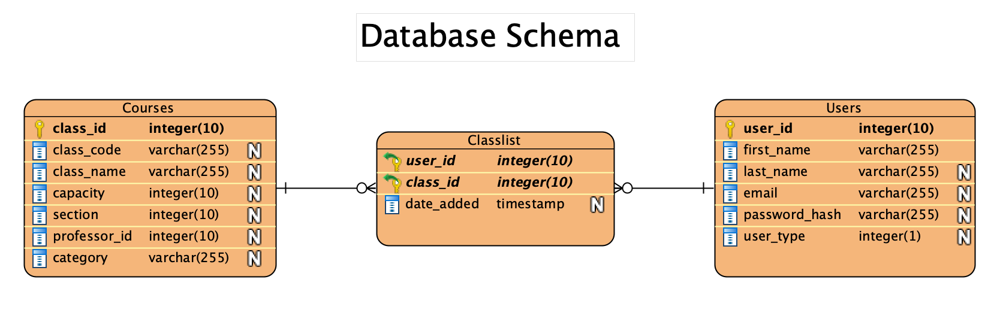

# Class Management System

A full-stack application for managing classes, students, and professors in an educational setting. The system supports basic CRUD operations allowing professors to manage classes and students. Professors can also generate instant reports in .txt file format. Students can view, register and drop classes. 

## Galery





## Project Overview

This Class Management System is built with a modern tech stack:
- **Frontend**: React with TypeScript, styled-components, and Material UI
- **Backend**: Express.js with PostgreSQL database
- **Authentication**: JWT-based authentication system and custom express middleware for RBAC

# Database Schema


## Features

### Professor Features
- Dashboard with class statistics and management tools
- Create, edit, and delete classes
- Add, update, and remove students
- Generate reports for specific classes
- View all students enrolled in classes

### Student Features
- Dashboard showing enrolled classes
- Register for available classes
- Drop enrolled classes

## Tech Stack

### Frontend
- React 19
- TypeScript
- React Router v7
- Styled Components
- Material UI v7
- Vite (for building and development)

### Backend
- Express.js
- PostgreSQL (using pg, pg-format, and pg-promise)
- JWT for authentication
- bcryptjs for password hashing

## Project Structure

### Frontend Structure
```
frontend/
├── src/
│   ├── Components/
│   │   ├── Admin/          # Professor-specific components
│   │   ├── Student/        # Student-specific components
│   │   ├── Login.tsx
│   │   └── Navbar.tsx
│   ├── Context/
│   │   └── useAuth.tsx     # Authentication context
│   ├── Models/             # TypeScript interfaces
│   ├── Screens/            # Main application pages
│   ├── Services/           # API service functions
│   ├── App.tsx             # Main application component
│   └── main.tsx           # Entry point
```

### Backend Structure
```
server/
├── src/
│   ├── config/             # Database configuration
│   ├── controllers/        # Request handlers
│   ├── middleware/         # Custom middleware
│   │   ├── authMiddleware.js
│   │   └── roleMiddleware.js
│   ├── routes/             # API routes
│   └── server.js           # Entry point
```

## Getting Started 

### Prerequisites
* Node.js
* PostgreSQL

### Installation
1. Clone repository
```
git clone <repository-url>
```
2. Install backend repos
```
cd server
npm install
```
3. Install frontend repos
```
cd frontend
npm install
```
4. Environment variables
Create a .env file with your JWT secret and database details
